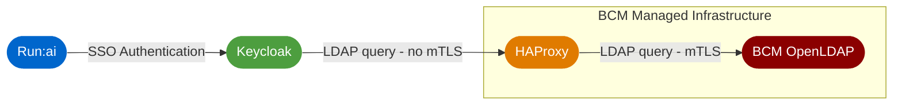

# SSO for Run:ai in Base Command Manager

This project includes file, scripts and code needed to set up a laboratory SSO provider for Run:ai. 

As run is deployed by Base Command Manager (BCM) in this lab, the the BCM managed OpenLDAP server is used as the Directory Service.

## Architecture Overview

Run:ai is configured to use Keycloak as the OIDC SSO provider.

Keycloak proved difficult to configure with mTLS in order to present a client certificate directly to BCM's OpenLDAP. Rather than disable the client certificate requirement in OpenLDAP, HAProxy is used to provide an ldap front end to Keycloak that does not require mTLS. HAProxy then handles the mTLS communications with the BCM OpenLDAP server.

