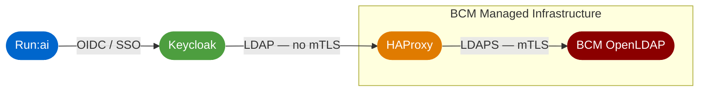

# SSO for Run:ai in Base Command Manager

This repository contains everything needed to configure Keycloak as an OIDC SSO provider for Run:ai when Run:ai is deployed by NVIDIA Base Command Manager (BCM). BCM's managed OpenLDAP server is used as the directory service.

## Architecture



Run:ai is configured to use Keycloak as its OIDC SSO provider. Keycloak federates users from BCM's OpenLDAP directory.

BCM's OpenLDAP requires mutual TLS (mTLS) for all LDAP client connections. Keycloak does not support presenting a client certificate directly to an LDAP backend, so HAProxy acts as an LDAP reverse proxy: Keycloak connects to HAProxy over plain LDAP on the internal Docker network, and HAProxy handles the mTLS handshake with BCM OpenLDAP over LDAPS (port 636).

## Repository Structure

```
.
├── bcm_ansible/                              # Ansible — batch-add users and groups to BCM
│   ├── group_vars/bcm/
│   │   ├── users.yaml.example                # User and group definitions
│   │   └── vault.yaml.example                # Ansible Vault password store
│   ├── inventory.yaml.example
│   ├── playbooks/add_users.yaml
│   ├── requirements.txt                      # Python dependencies
│   └── requirements.yaml                     # Ansible collection dependencies
│
├── keycloak_docker/                          # Docker Compose stack
│   ├── compose.yaml                          # postgres, keycloak, ldap-proxy services
│   ├── haproxy/haproxy.cfg                   # Plain LDAP in → LDAPS+mTLS out
│   └── keycloak/image/Dockerfile             # Keycloak image with custom provider pre-installed
│
└── keycloak_supplementarygroups_provider/    # Custom Keycloak OIDC protocol mapper
    ├── Dockerfile                            # Build environment (Debian + JDK 21 + Maven)
    └── keycloak-gid-mapper/
        ├── pom.xml
        └── src/.../SupplementaryGroupsMapper.java
```

## Components

### Keycloak Docker Stack (`keycloak_docker/`)

Three services defined in `compose.yaml`:

| Service | Image | Purpose |
|---------|-------|---------|
| `postgres` | postgres:16 | Database backend for Keycloak |
| `keycloak` | Custom build | Keycloak with the supplementary groups provider installed. Exposed on port `443`. |
| `ldap-proxy` | haproxy:3.0 | Proxies plain LDAP from Keycloak to LDAPS on BCM OpenLDAP with mTLS. Internal only — not exposed to the host. |

See [`keycloak_docker/README.md`](keycloak_docker/README.md) for detail on certificates, environment variables, and operating the stack.

### Supplementary Groups Provider (`keycloak_supplementarygroups_provider/`)

A custom Keycloak OIDC protocol mapper that adds two claims to issued tokens:

| Claim | Content |
|-------|---------|
| `GROUPS` | List of LDAP group names the user belongs to |
| `SUPPLEMENTARYGROUPS` | List of integer `gidNumber` values for those groups |

Run:ai uses these claims for workload identity and permissions mapping. Keycloak's built-in mappers do not expose the numeric `gidNumber` attribute that BCM uses to identify groups, which is why this custom mapper is needed.

See [`keycloak_supplementarygroups_provider/README.md`](keycloak_supplementarygroups_provider/README.md) for build and installation instructions.

### BCM Ansible Playbooks (`bcm_ansible/`)

Ansible playbooks using the `brightcomputing.bcm110` collection to batch-create users and groups in BCM's OpenLDAP. Users must exist in BCM before Keycloak can federate them. See [`bcm_ansible/README.md`](bcm_ansible/README.md) for usage.

---

## Setup

### Prerequisites

- Docker and Docker Compose
- A TLS certificate and key for Keycloak (must be trusted by Run:ai and by any admin browsers)
- The BCM OpenLDAP CA certificate and an mTLS client certificate/key for HAProxy
- BCM LDAP bind credentials (a service account DN and password with read access to users and groups)
- Python 3 (only needed for the Ansible playbooks)

---

### Step 1 — Add Users to BCM (if needed)

Users must exist in BCM's OpenLDAP before Keycloak can federate them. If your users are not yet in BCM, use the Ansible playbooks in `bcm_ansible/` to create them. See [`bcm_ansible/README.md`](bcm_ansible/README.md) for instructions.

If your users already exist in BCM, skip to Step 2.

---

### Step 2 — Build the Supplementary Groups Provider

The Keycloak image requires the custom provider `.jar` to be present before the image is built. See [`keycloak_supplementarygroups_provider/README.md`](keycloak_supplementarygroups_provider/README.md) for build instructions, then copy the output:

```shell
cp keycloak_supplementarygroups_provider/keycloak-gid-mapper/target/keycloak-gid-mapper-1.0.0.jar \
   keycloak_docker/keycloak/image/keycloak_providers/
```

---

### Step 3 — Place TLS Certificates

**Keycloak HTTPS certificate** — place in `keycloak_docker/keycloak_certs/`:

```
keycloak_certs/
├── Keycloak_BCM.crt    # TLS server certificate (or full chain)
└── Keycloak_BCM.key    # Private key
```

**HAProxy mTLS certificates** — place in `keycloak_docker/haproxy/certs/`:

```
haproxy/certs/
├── ldap-ca.pem         # CA that signed the BCM OpenLDAP server certificate
└── ldap-client.pem     # Client certificate and private key, concatenated
```

The BCM OpenLDAP CA certificate is on the head node at `/cm/local/apps/openldap/etc/certs/ca.pem`. Copy it to `haproxy/certs/ldap-ca.pem`.

To generate the client certificate, run the following from the **HA Active head node**:

```shell
cm-component-certificate --generate=<nodename>
```

This writes a `.crt` and `.key` to the current directory (use `--outputdir` to specify a different location). Concatenate them for HAProxy:

```shell
cat <nodename>.crt <nodename>.key > keycloak_docker/haproxy/certs/ldap-client.pem
```

Both certificate directories are gitignored.

---

### Step 4 — Configure the Environment

Create `keycloak_docker/.env` (gitignored):

```env
# PostgreSQL
POSTGRES_DB=keycloak
POSTGRES_USER=keycloak
POSTGRES_PASSWORD=<random alphanumeric string>

# Keycloak bootstrap admin — change after first login
KC_BOOTSTRAP_ADMIN_USERNAME=admin
KC_BOOTSTRAP_ADMIN_PASSWORD=<random alphanumeric string>

# IP address of the BCM OpenLDAP server
# Must match the CN or a SAN on the BCM OpenLDAP TLS certificate
BCM_LDAP_IP=10.141.255.254
```

---

### Step 5 — Start the Stack

```shell
cd keycloak_docker
docker compose up -d --build
```

Keycloak will be available at `https://<host>/admin`. On first start, allow a minute for Postgres to initialise before Keycloak comes up.

**Change the bootstrap admin password immediately after first login.**

---

### Step 6 — Configure Keycloak

Log in to the Keycloak admin console and complete the following steps in your realm.

#### 6a — Add LDAP User Federation

1. Go to **User Federation** → **Add provider** → **LDAP**.
2. Set **Connection URL** to `ldap://ldap-proxy:389`.
   - `ldap-proxy` is the HAProxy service name on the internal Docker network. Keycloak resolves it via Docker's internal DNS. Do not use `localhost` or an external address.
3. Set **Bind DN** and **Bind Credentials** to the BCM service account that has read access to users and groups.
4. Set **Users DN** to the base DN for user objects in BCM's LDAP (e.g. `ou=People,o=local`).
5. Set **User object classes** to `inetOrgPerson,posixAccount` (BCM uses standard POSIX schema).
6. Enable **Import Users** and save. Use **Test connection** and **Test authentication** to verify.

#### 6b — Sync LDAP Groups and the `gidNumber` Attribute

The `SUPPLEMENTARYGROUPS` token claim is populated from the `gidNumber` attribute on Keycloak groups, which must be synchronised from LDAP. Without this step the claim will be empty.

1. In the LDAP provider you just created, go to the **Mappers** tab.
2. Click **Add mapper** and select **group-ldap-mapper**.
3. Configure it:
   - **LDAP Groups DN**: the base DN for group objects in BCM's LDAP (e.g. `ou=Group,o=local`)
   - **Group Object Classes**: `posixGroup`
   - **Membership LDAP Attribute**: `memberUid`
   - **Membership Attribute Type**: `UID`
   - **Group Attributes**: add `gidNumber`
4. Save, then click **Sync LDAP Groups to Keycloak**.

#### 6c — Create the Run:ai OIDC Client

1. Go to **Clients** → **Create client**.
2. Set **Client type** to `OpenID Connect` and give it a meaningful **Client ID** (e.g. `runai`).
3. Set **Valid redirect URIs** to the Run:ai callback URL.
4. Set **Client authentication** to `On` (confidential client) and save.
5. Note the **Client Secret** from the **Credentials** tab — you will need it when configuring Run:ai.

#### 6d — Add the Supplementary Groups Mapper

1. In the Run:ai client, go to the **Client scopes** tab.
2. Open the dedicated scope (named `<client-id>-dedicated`).
3. Click **Add mapper** → **By configuration**.
4. Select **Supplementary Groups (GID) Mapper**.
5. Set **Token Claim Name** to `SUPPLEMENTARYGROUPS`.
6. Enable **Add to ID token** and **Add to access token**. Save.

---

### Step 7 — Configure Run:ai

In the Run:ai control plane, navigate to **Settings** → **SSO** and configure the OIDC provider:

| Field | Value |
|-------|-------|
| Issuer URL | `https://<keycloak-host>/realms/<realm-name>` |
| Client ID | the client ID from Step 6c |
| Client Secret | the client secret from Step 6c |
| Groups claim | `GROUPS` |
| Supplementary groups claim | `SUPPLEMENTARYGROUPS` |

Save and test by logging in to Run:ai with a BCM user account.
